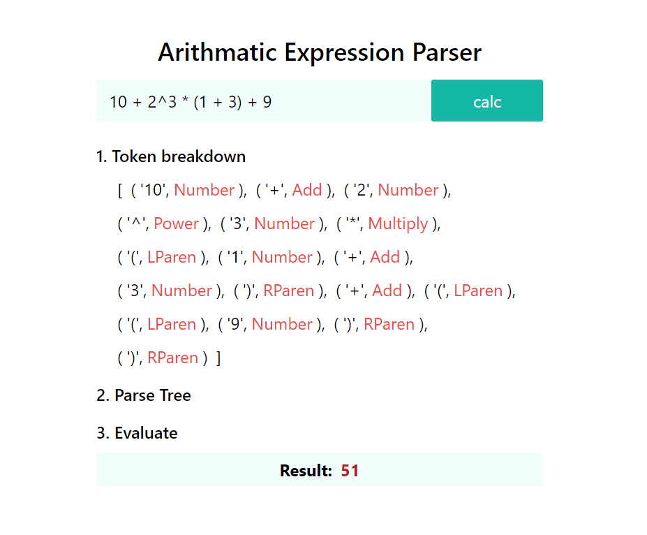

# Simple Arithmatic Expression Parser

Basic recursive descent parser that parses expressions with operator precedence in TypeScript.

#### Left to implement:

- Improve error messages
- Realtime syntax error highlighting
- Interactive parse tree visualization for the expression you enter
